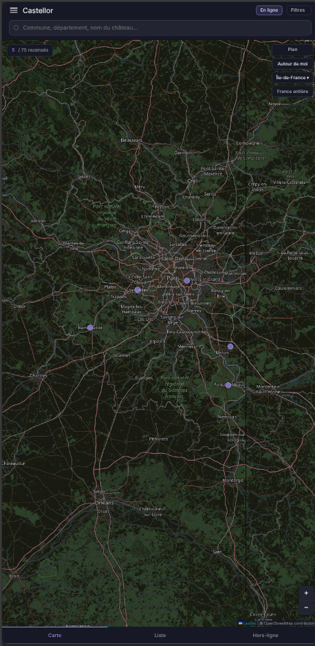
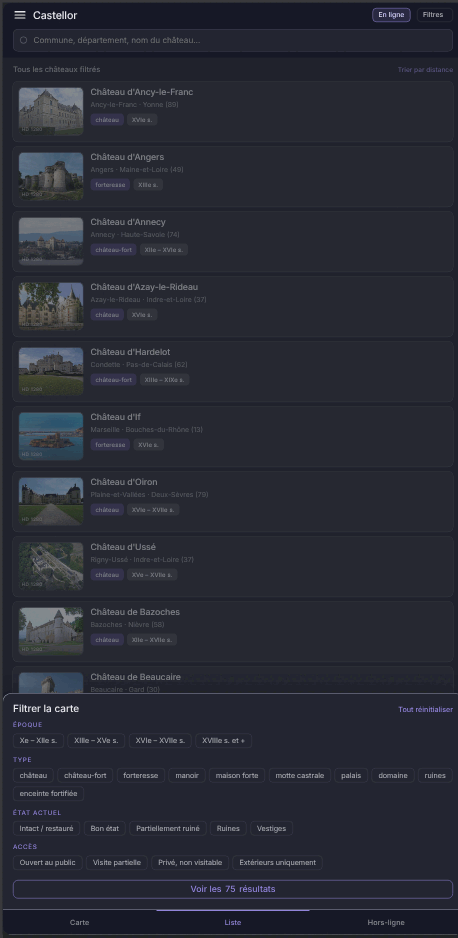
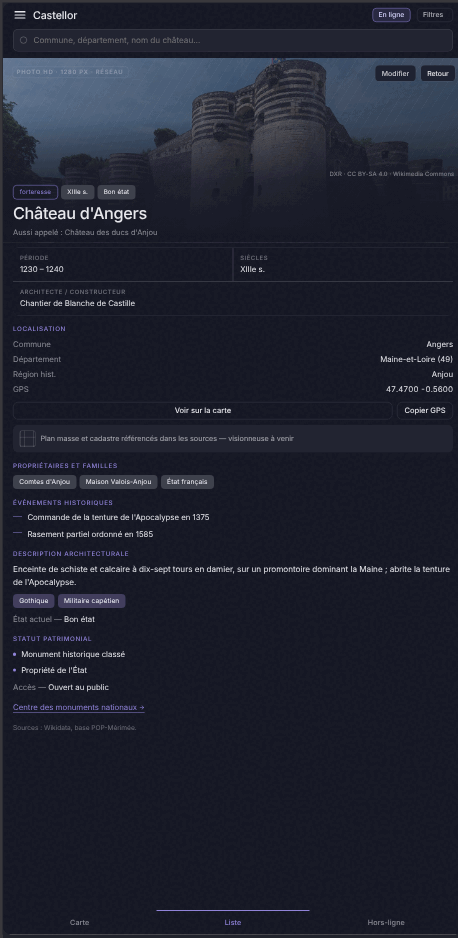
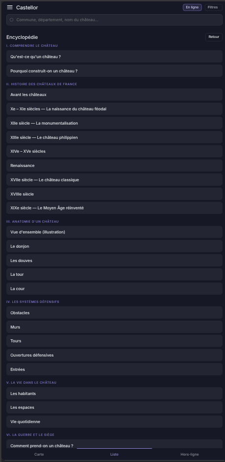

# Castellor

**Recensement des châteaux de France, pensé pour la voiture.** La carte est
l'écran d'accueil, la fiche s'ouvre sur sa photo, et tout le texte reste
lisible sans réseau.

- **Version** : 0.2.1 — *PWA installable*
- **Statut** : installable sur Android, déployable sur Netlify, fonctionne hors connexion
- **Langue** : français
- **Licence** : [MIT](LICENSE)
- **Documentation** : suit `DOCUMENTATION_SPEC.md` (voir [CONTEXT.md](CONTEXT.md))

---

## Captures d'écran

<table>
<tr>
<td align="center" width="50%">
<br>
<sub>Carte — vue par défaut sur l'Île-de-France</sub>
</td>
<td align="center" width="50%">
<br>
<sub>Liste et filtres</sub>
</td>
</tr>
<tr>
<td align="center" width="50%">
<br>
<sub>Fiche d'un château (Angers)</sub>
</td>
<td align="center" width="50%">
<br>
<sub>Encyclopédie</sub>
</td>
</tr>
</table>

---

## Sommaire

- [Captures d'écran](#captures-décran)
- [Ce que fait l'application](#ce-que-fait-lapplication)
- [Lancer et déployer](#lancer-et-déployer)
- [Les trois onglets](#les-trois-onglets)
- [Fonctionnalités](#fonctionnalités)
- [Encyclopédie](#encyclopédie)
- [Données](#données)
- [Stockage local](#stockage-local)
- [Permissions](#permissions)
- [Réseau et mode hors connexion](#réseau-et-mode-hors-connexion)
- [Structure du projet](#structure-du-projet)
- [Dépannage](#dépannage)
- [Limites connues](#limites-connues)
- [Crédits et licences](#crédits-et-licences)

---

## Ce que fait l'application

Castellor affiche **75 châteaux français géolocalisés** sur une carte sombre.
Chaque château dispose d'une fiche détaillée : période de construction,
architecte, propriétaires successifs, événements historiques, description
architecturale, statut patrimonial et conditions d'accès.

L'application est conçue pour un usage en déplacement : elle bascule en mode
hors connexion, où les fiches texte restent intégralement consultables et les
photos passent en vignettes basse résolution mises en cache.

## Lancer et déployer

### En local

```sh
python3 -m http.server 8000     # puis ouvrir http://localhost:8000/
```

Le service worker et l'installation exigent HTTPS, sauf sur `localhost` où le
navigateur les autorise — le local suffit donc pour tout tester.

### Régénérer l'application

`index.html` est **dérivé** de `Castellor.dc.html` : ne jamais l'éditer à la
main. Après toute modification du canvas :

```sh
python3 tools/build-pwa.py
```

Le script retire le décor de maquette (fausse barre d'état, colonne
d'annotations), déplie l'artboard 430 × 900 sur tout l'écran, redirige les
dépendances vers `vendor/` et branche manifeste et service worker.

### Déployer sur Netlify

`netlify.toml` porte déjà la configuration. Dans l'interface Netlify :

| Réglage | Valeur |
| --- | --- |
| **Base directory** | *(vide)* |
| **Build command** | *(vide)* |
| **Publish directory** | `.` |

Il n'y a rien à compiler à l'arrivée : `index.html` est versionné. Netlify sert
le site en HTTPS, ce qui suffit à rendre l'application installable.

### Installer sur Android

Ouvrir le site dans Chrome, puis **⋮ → Ajouter à l'écran d'accueil**. Chrome
propose aussi l'installation spontanément. L'application s'ouvre ensuite en
plein écran, sans barre d'adresse.

### Ouvrir le canvas de conception

`Castellor.dc.html` reste la source : il s'ouvre dans l'environnement Claude
Design, avec sa colonne d'annotations et son cadre de téléphone.

## Les trois onglets

La barre de navigation basse comporte trois onglets. Changer d'onglet ferme la
fiche ouverte et sort du mode édition.

| Onglet | Contenu |
| --- | --- |
| **Carte** | Carte Leaflet plein écran, marqueurs, carte de sélection |
| **Liste** | Les châteaux filtrés, en liste avec vignette |
| **Hors-ligne** | État du cache, données, sources, crédits photo, contributions |

## Fonctionnalités

### Recherche

Le champ en haut de l'écran filtre sur : le nom du château, ses **variantes
historiques**, la commune, le département et la région historique. La recherche
est insensible à la casse et fonctionne par correspondance partielle. Elle
s'applique simultanément à la carte et à la liste.

### Filtres

Le bouton **Filtres** ouvre une feuille depuis le bas de l'écran. Quatre
groupes :

| Groupe | Valeurs |
| --- | --- |
| **Époque** | Xe – XIIe s. · XIIIe – XVe s. · XVIe – XVIIe s. · XVIIIe s. et + |
| **Type** | château · château-fort · forteresse · manoir · maison forte · motte castrale · palais · domaine · ruines · enceinte fortifiée |
| **État actuel** | Intact / restauré · Bon état · Partiellement ruiné · Ruines · Vestiges |
| **Accès** | Ouvert au public · Visite partielle · Privé, non visitable · Extérieurs uniquement |

Plusieurs valeurs d'un même groupe se cumulent (**OU**) ; les groupes se
combinent entre eux (**ET**). Un château correspond au filtre Époque si l'un de
ses siècles tombe dans l'intervalle choisi.

Le nombre de filtres actifs s'affiche en pastille sur le bouton. **Tout
réinitialiser** vide les quatre groupes **et** le champ de recherche.

### Carte

- Fond **OpenStreetMap** assombri par filtre CSS (inversion + rotation de
  teinte), ou **satellite Esri World Imagery**.
- Les marqueurs sont des pastilles : accent violet pour les édifices debout,
  gris translucide pour les ruines et vestiges (`type = ruines`, ou état
  `Ruines` / `Vestiges`).
- Le marqueur sélectionné grossit et reçoit un halo.
- Un clic sur un marqueur ouvre la **carte de sélection** en bas de l'écran
  (photo, nom, commune, département, type, état), avec « Ouvrir la fiche ».
- **France entière** recadre la carte sur l'ensemble des châteaux visibles.
- Les contrôles de zoom sont en bas à droite.

### Autour de moi

Demande la position de l'appareil, place un repère et un cercle de 18 km, centre
la carte au zoom 8 et trie la liste par distance croissante.

Si la géolocalisation est refusée ou indisponible, l'application se replie
**silencieusement** sur une position par défaut (47.3941, 0.6848 — région de
Tours) et se comporte comme si la position était connue.

### Liste

Chaque ligne affiche vignette, nom, commune · département, type et siècles. Par
défaut, la liste est triée **alphabétiquement** sur le nom (comparaison
française, insensible à la casse et aux accents). Une fois la position connue,
la distance en kilomètres s'ajoute à droite et le lien en haut bascule entre
« Trier par distance » et « Trier A→Z ».

Si aucun château ne correspond, un lien **Réinitialiser les filtres** est
proposé.

### Fiche détaillée

La fiche s'ouvre par-dessus l'onglet courant, photo en tête (296 px), et
contient :

- les étiquettes type / siècles / état ;
- le nom et les variantes historiques (« Aussi appelé : … ») ;
- **Période**, **Siècles**, **Architecte / constructeur** ;
- **Localisation** : commune, département, région historique, coordonnées GPS à
  4 décimales ;
- **Propriétaires et familles** ;
- **Événements historiques** ;
- **Description architecturale** + styles + état actuel ;
- **Statut patrimonial**, conditions d'accès, liens officiels ;
- une ligne de provenance des sources.

Deux actions : **Voir sur la carte** (ferme la fiche, centre la carte au zoom
13) et **Copier GPS** (copie `latitude, longitude` dans le presse-papiers, le
bouton affiche « Copié » pendant 1,4 s).

### Édition et contributions locales

Le bouton **Modifier** en haut de la fiche ouvre le mode édition. On peut
y modifier le **nom**, la **description architecturale**, et **ajouter un
événement daté**.

**Enregistrer sur l'appareil** stocke la modification en local ; elle est ensuite
superposée à la fiche d'origine à chaque affichage, et la ligne de provenance
indique « Contient une contribution locale non validée ». **Annuler** abandonne
les changements en cours.

L'onglet **Hors-ligne** affiche le nombre de fiches modifiées, rappelle
qu'aucune remontée vers un serveur n'existe, et propose **Effacer les
contributions locales**, qui supprime toutes les contributions d'un coup —
**sans confirmation**.

> Les autres champs de la fiche (propriétaires, statut patrimonial, accès,
> liens, coordonnées…) ne sont pas éditables dans cette version.

## Encyclopédie

Accessible depuis le menu (section **Découvrir**), l'Encyclopédie est un
contenu de référence sur les châteaux forts et leur histoire, entièrement
local : le texte est livré avec l'application dans `encyclopedie-data.js`,
sans aucun appel réseau. Elle fonctionne donc à l'identique en ligne et hors
connexion, et son sommaire tient lui aussi dans le cache de l'application (voir
[Réseau et mode hors connexion](#réseau-et-mode-hors-connexion)).

Elle compte **15 parties**, chacune divisée en plusieurs chapitres :

| Partie | Sujet |
| --- | --- |
| I | Comprendre le château |
| II | Histoire des châteaux de France |
| III | Anatomie d'un château |
| IV | Les systèmes défensifs |
| V | La vie dans le château |
| VI | La guerre et le siège |
| VII | Les techniques de construction |
| VIII | Le territoire du château |
| IX | Typologie des châteaux |
| X | Le château et le pouvoir |
| XI | Châteaux célèbres |
| XII | Patrimoine et restauration |
| XIII | Archéologie castrale |
| XIV | Châteaux disparus |
| XV | Mythes et idées reçues |

La plupart des chapitres sont du texte simple (deux paragraphes). Deux
chapitres sortent de ce format :

- **Vue d'ensemble (illustration)**, dans la partie III : un schéma
  interactif du château où chaque élément touché (donjon, tour, courtine,
  cour, herse, pont-levis, douves) ouvre soit son propre article, soit
  l'entrée correspondante du **Glossaire**.
- **Simulation : mener un siège**, dans la partie VI : un mini-jeu
  pédagogique où l'utilisateur choisit une tactique et, en option, une
  machine de siège, puis lance un siège dont l'issue comporte une part de
  hasard.

Le sommaire liste les 15 parties et leurs chapitres ; le bouton **Retour**
ramène du chapitre au sommaire, puis du sommaire à l'écran précédent.

> Contenu de synthèse généraliste, écrit pour l'application — pas une base de
> faits vérifiés fiche par fiche comme `chateaux-data.js` : à corriger si une
> inexactitude est repérée (voir l'en-tête d'`encyclopedie-data.js`).

## Données

Les 75 fiches sont un **jeu de démonstration saisi à la main**, dans
`chateaux-data.js` (35 fiches initiales, puis deux ajouts le 26 août 2026 en
suivant Wikipédia fr comme source : 15 fiches, puis 25 de plus). Trois objets
globaux y sont exposés :

| Global | Rôle |
| --- | --- |
| `window.CASTELLUM_FILTERS` | Les valeurs des quatre groupes de filtres |
| `window.CASTELLUM_WIKI` | `id` du château → titre de l'article Wikipédia fr, pour la photo |
| `window.CASTELLUM` | Les 75 fiches |

Champs d'une fiche : `id`, `n` (nom), `v` (variantes), `t` (type), `sc`
(siècles), `per` (période), `arch` (architecte), `prop` (propriétaires), `ev`
(événements), `desc`, `st` (styles), `etat`, `stat` (statut patrimonial), `acc`
(accès), `com` (commune), `dep` (département), `reg` (région historique), `lat`,
`lng`, `plan` (booléen), `liens`.

Sources annoncées dans l'application : **Wikidata** (identités, coordonnées),
**POP / Mérimée** (statut patrimonial), import CSV / JSON personnel, saisie dans
l'app. Ces imports **ne sont pas encore implémentés** : la structure des données
anticipe l'import Wikidata / POP.

### Photos

Aucune photo n'est stockée dans le dépôt. Au démarrage, l'application interroge
l'API REST de Wikipédia fr (`/page/summary/<titre>`) pour chaque entrée de
`CASTELLUM_WIKI`, en 4 requêtes parallèles. Elle extrait le nom du fichier image
et reconstruit deux URL via `Special:FilePath` :

- **vignette** — `?width=400`, utilisée en liste et hors connexion ;
- **haute résolution** — `?width=1280`, utilisée en tête de fiche, en ligne.

Les URL obtenues sont mises en cache dans le navigateur, donc les appels ne sont
faits qu'une fois par appareil.

Les 75 fichiers sont hébergés sur Wikimedia Commons et sous licence libre. Le
détail — fichier, licence, auteur — est dans [PHOTOS.md](PHOTOS.md), avec le
script qui permet de rejouer l'audit.

**Attribution.** Au même moment, l'application lit l'auteur et la licence de
chaque fichier (`prop=imageinfo&iiprop=extmetadata`) et les affiche : sous la
photo de la fiche, en lien vers la page Commons du fichier, et dans la liste
complète de l'onglet **Hors-ligne**. C'est ce qu'exigent les licences CC BY et
CC BY-SA, qui couvrent 69 des 75 clichés.

## Stockage local

Tout est en `localStorage`, sur l'appareil, sans serveur :

| Clé | Contenu | Effacement |
| --- | --- | --- |
| `castellor-photos-v3` | URL, auteur et licence des photos résolues | Vider les données du site |
| `castellum-drafts` | Contributions locales, par `id` de château | Bouton « Effacer les contributions locales » |

Si `localStorage` est indisponible (navigation privée stricte, stockage bloqué),
l'application continue de fonctionner : les échecs de lecture et d'écriture sont
ignorés, mais les contributions et le cache photo sont perdus au rechargement.

S'y ajoutent les caches du service worker, gérés par le navigateur et vidés
avec les données du site.

**Aucune donnée n'est envoyée à un serveur Castellor** — il n'y en a pas.

## Permissions

| Permission | Quand | Si refusée |
| --- | --- | --- |
| **Géolocalisation** | Bouton « Autour de moi » et « Trier par distance » | Repli silencieux sur 47.3941, 0.6848 |
| **Presse-papiers (écriture)** | Bouton « Copier GPS » | Le bouton affiche quand même « Copié » ; l'échec est ignoré |

Aucune permission n'est demandée au lancement.

## Réseau et mode hors connexion

L'application démarre dans l'**état réseau réel** de l'appareil et suit les
événements `online` / `offline` du navigateur. Le bouton **En ligne /
Hors-ligne** de l'en-tête reste un **forçage manuel**, utile pour montrer le
mode dégradé sans couper quoi que ce soit.

| | En ligne | Hors-ligne |
| --- | --- | --- |
| Fiches texte | complètes | complètes |
| Photo de fiche | HD 1280 px | vignette 400 px, désaturée et légèrement floutée |
| Vignettes de liste | 400 px | 400 px, désaturées |
| Satellite | disponible | **désactivé**, bouton grisé |
| Fond de carte | normal | assombri, désaturé, opacité réduite |
| Bandeau | — | Indique si le cache de l'application est actif |

### Ce qui est mis en cache

Une fois l'application installée, son service worker (`sw.js`) tient quatre
caches distincts :

| Cache | Contenu | Stratégie | Plafond |
| --- | --- | --- | --- |
| `castellor-shell` | Code, styles, polices, icônes, données | Cache d'abord | — |
| `castellor-tuiles` | Tuiles OpenStreetMap déjà consultées | Cache d'abord | 900 |
| `castellor-photos` | Photographies Wikimedia déjà vues | Cache d'abord | 250 |
| `castellor-meta` | Résumés et crédits de licence | Réseau d'abord | 120 |

L'**imagerie satellite n'est volontairement pas mise en cache** : la stocker
remplirait l'appareil sans bénéfice réel, puisqu'elle est déjà indisponible
hors connexion.

Au-delà du plafond, les entrées les plus anciennes sont supprimées.

### Domaines contactés

| Domaine | Pour quoi |
| --- | --- |
| `unpkg.com` | Leaflet 1.9.4 (CSS + JS, avec intégrité SRI) |
| `tile.openstreetmap.org` | Tuiles du fond de carte |
| `server.arcgisonline.com` | Tuiles satellite Esri |
| `fr.wikipedia.org` | Résumés d'articles et fichiers image |
| `commons.wikimedia.org` | Fichiers image hébergés sur Commons |

## Structure du projet

```
Castellor.dc.html    Le canvas : maquette + logique — LA SOURCE
index.html           L'application installable — GÉNÉRÉ par tools/build-pwa.py
manifest.webmanifest Manifeste PWA (nom, icônes, plein écran)
sw.js                Service worker : coquille, tuiles, photos, métadonnées
netlify.toml         Déploiement, en-têtes de cache et CSP
castellum-map.js     <castellum-map>, la carte Leaflet
chateaux-data.js     Les 75 fiches, les filtres, les titres Wikipédia
glossaire-data.js    Les entrées du Glossaire
encyclopedie-data.js Les 15 parties de l'Encyclopédie
support.js           Runtime Claude Design — GÉNÉRÉ, ne pas modifier
vendor/              React, Leaflet, Inter, Nocturne — servis depuis le domaine
icons/               Icônes PWA — GÉNÉRÉES par tools/make-icons.py
tools/               build-pwa.py · make-icons.py · fetch-fonts.sh · audit licences
_ds/nocturne-…/      Design system Nocturne (tokens, styles, composants)
uploads/             Capture d'écran de travail
.thumbnail           Vignette du canvas
```

## Dépannage

### Les photos ou les tuiles n'apparaissent pas sur le site déployé

Regarder l'onglet **Réseau**, pas la console : une requête bloquée par la `CSP`
depuis le **service worker** échoue en `net::ERR_FAILED` **sans** afficher de
violation dans la console de la page.

Dans un service worker, tuiles et photos passent par `fetch()`, donc par
**`connect-src`** — et non par `img-src`, qui ne régit que les images chargées
directement par la page. `connect-src` doit aussi couvrir les **cibles de
redirection** : `Special:FilePath` renvoie systématiquement vers
`upload.wikimedia.org`.

### Une ancienne version reste affichée après un déploiement

Le service worker sert sa copie en cache. Il se met à jour au chargement
suivant, mais pour forcer : **Paramètres du site → Effacer les données**, ou
désinstaller puis réinstaller l'application. La version des caches (`VERSION`
dans `sw.js`) doit être incrémentée à chaque changement de leur contenu.

### La carte est vide hors connexion

Le cache se remplit **à l'usage** : une zone jamais consultée en ligne n'a
aucune tuile. Il n'existe pas de téléchargement préalable d'une région.

### Aucun crédit sous une photo

Le crédit vient d'un second appel à l'API Commons. S'il a échoué, la photo
s'affiche seule ; le crédit apparaît au chargement suivant.

## Limites connues

- **Le cache se remplit à l'usage.** Un château jamais consulté n'a ni tuile ni
  photo en cache : hors connexion, sa fiche s'affiche en texte, sans image, sur
  un fond de carte vide. Il n'existe pas de téléchargement préalable d'une
  région.
- **Le canvas ouvert directement n'a pas de service worker** — seule
  l'application servie par HTTP en a un. Le bandeau hors connexion le dit.
- **75 fiches** de démonstration, pas les ~500 visées.
- **Lien officiel** : 13 fiches sur 75 en ont un ; les 62 autres affichent
  « Aucun lien officiel renseigné — contribution bienvenue ».
- **Plans et cadastres** : 44 fiches sur 75 sont marquées `plan: true` et
  signalent des plans « référencés dans les sources », mais **aucune
  visionneuse n'existe** et aucun plan n'est fourni.
- Le tri **« A→Z »** porte sur le nom affiché tel quel : « Château royal
  d'Amboise » se classe à *royal*, et les douze fiches qui ne commencent pas
  par « Château » (Cité de Carcassonne, Forteresse royale de Chinon, Palais des
  papes d'Avignon, Citadelle de Sisteron…) se dispersent dans la liste.
- **Auteur non précisé** sous une photo n'indique pas toujours un second appel
  raté (voir ci-dessous) : le fichier du château du Haut-Barr est du domaine
  public sans auteur déclaré sur Commons, donc affiché sans attribution alors
  qu'il n'y en a pas d'exigée.
- Les crédits photo dépendent d'un second appel à l'API Commons. S'il échoue,
  la photo s'affiche sans attribution — le crédit apparaît au rechargement
  suivant, une fois la métadonnée obtenue.
- Les contributions locales ne quittent jamais l'appareil : **aucun mécanisme de
  remontée n'existe**, et l'interface le dit désormais explicitement.
- L'heure « 9:41 » de la barre d'état est un décor de maquette.

## Crédits et licences

- Cartographie : **© OpenStreetMap contributors**
- Imagerie satellite : **Esri, Maxar, Earthstar Geographics**
- Photographies : **Wikimedia Commons** — CC BY-SA, CC BY et CC0,
  [détail par fiche](PHOTOS.md)
- Bibliothèque carte : **Leaflet 1.9.4** (BSD-2-Clause)
- Interface : design system **Nocturne** (`_ds/`), typographie Inter
- Contenu patrimonial : **Wikidata**, base **POP / Mérimée**

### Licence

Le code de Castellor est publié sous licence **[MIT](LICENSE)**.

Cette licence couvre le code écrit pour ce projet : `Castellor.dc.html`,
`castellum-map.js` et `chateaux-data.js`. Elle **ne s'étend pas** aux éléments
tiers présents dans le dépôt ou chargés à l'exécution, qui gardent leurs
conditions propres :

| Élément | Statut |
| --- | --- |
| `support.js` | Runtime Claude Design, généré — conditions de l'outil |
| `_ds/nocturne-…/` | Design system Nocturne — conditions de l'outil |
| Leaflet 1.9.4 | BSD-2-Clause |
| Tuiles OpenStreetMap | ODbL, attribution obligatoire |
| Imagerie satellite Esri | Conditions Esri |
| Photographies Wikimedia | CC BY-SA, CC BY ou CC0 — [vérifiées fiche par fiche](PHOTOS.md) |
| Contenu patrimonial (Wikidata, POP / Mérimée) | Licences propres aux bases |

> **À vérifier** : aucune mention légale ni politique de confidentialité n'a été
> rédigée. Ces contenus juridiques doivent être écrits et **validés par une
> personne** avant publication.
